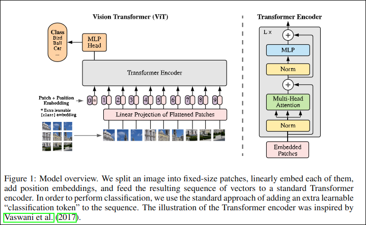
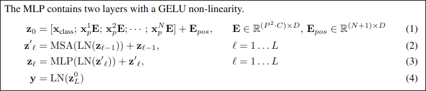
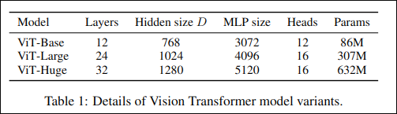
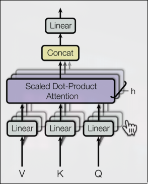
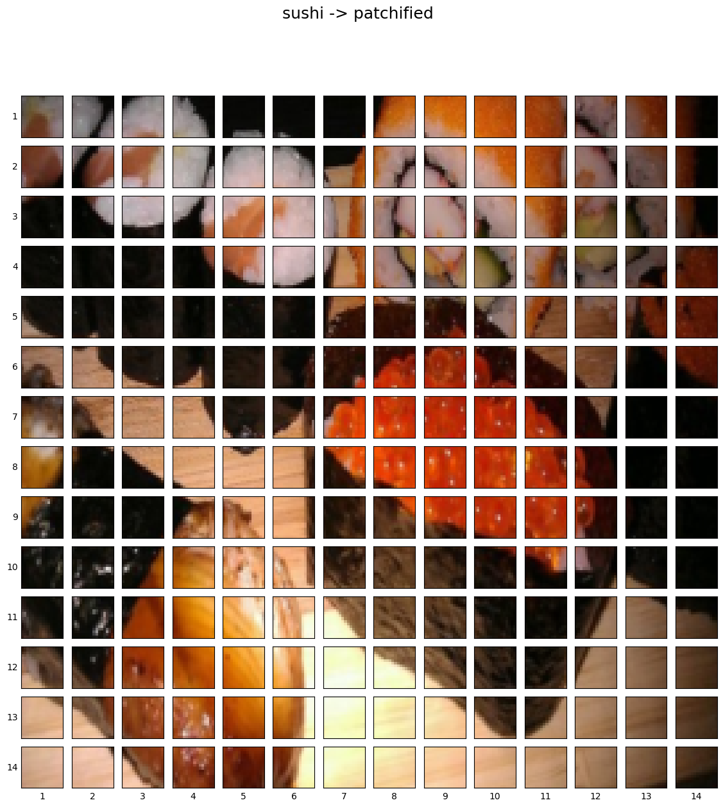
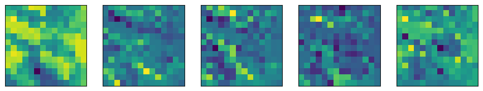

# Vision Transformer Implementation

Research Paper: [An Image is Worth 16x16 Words: Transformers for Image Recognition at Scale](https://arxiv.org/abs/2010.11929)

# overview of the paper
- figure 1: viual overview of the architecture
- four equations: math equations which define the function ofeach layer/block
- table 1/3: diffrente hyperparamters for the architecture/trianing.
- text

### figure 1
<!--  -->

* embedding - learnable representation (start with random numbers and improve them overtime) 
* mlp = multilevel perceptron


### four equations
<!--  -->


Equaion1:
* embedding - learnable representation (start with random numbers and improve them overtime) 
* path embeddings - patches of original image - pink
* position embeddings - to retain positional information -  purple
* class token embedding - to perform classification (*/pink)

```python
x_input = [learnable_class_token, image_patch_embeddings_1, image_patch_embeddings_2,...image_patch_embeddings_N]+
            [learnable_class_token_pos, image_patch_1_embeddings_pos, image_patch_2_embeddings_pos,...image_patch_N_embeddings_pos]
```

Equation2:
* MSA = Multi-Head self attention (Multi-Head Attension)
* LN = LayerNorm (Norm))
* zv(l-1) = input before LN block, adding residual connections (+)

```python
x_output_MSA_block = MSA_layer(LN_layer(x_input)) + x_input 

```

Equation3:
* MLP = MultiLayer Perceptron
* LN = LayerNorm
* z'v(l) = input before LN block, adding residual connections (+)

```python
x_output_MLP_block = MLP_layer(LN_layer(x_output_MSA_block)) + x_output_MSA_block
```

Equation4:
* MLP = MultiLayer Perceptron - a nerual network with x no. of layers
* MLP = one hidden layer at training time
* MLP = single linear layer in fine-tuning time
* LN = LayerNorm

```python
y = Linear_layer(LN_layer(x_output_MLP_block)) 
```
or
```python
y = MLP(LN_layer(x_output_MLP_block)) 
```

### table 1/3:
<!--  -->


#### all different sizes of the same model
#### ViT-B/16 - ViT-Base with image patch size 16x16

* layers = no. of transformers encoder layers
* hidden size $D$  - the embedding size throughout the architecture

                    - if we have embedding size of 768 means 

                    - each image patch that may be 16x16 

                    - is turned into a vector of size 768

                    - learnable vector*
                    
* MLP size - no. of hidden units/neurons in the MLP

            - if the MLP size is 3072 
            - then the no of hidden units in the MLP layer in 3072

* Heads - the number of heads within multihead self-attention layers

        - if heads = 12 we have 12 heads in MSA layer
        
<!-- >  -->
>
        
        - denoted by h


>## Equation 1: split data into patches and creating the class, position and patch embedding 

### layers = input -> function -> output 

* what's the input shape?
* whats the output shape?

one of the biggest porblems in dl are misaligned tensor shapes

* Input shape: (224,224) -> single image -> (height, width, color channels)
* Output shape: 

* Input shape: $H*W*C$ [hieight,width, color channels]
* output shape: $N\times(P^2*C)$
- H = height
- W = width
- C = Color channels
- P = patchs ize
- N = number of patches = (height*width)/p^2
- D =  constant latent vector size = embedding dimension (see table 1)

```py
# exmaple values 
height = 224
width = 224
color_channels = 3
patch_size = 16

#calc the number of patches
num_patches = int((height *width) / (patch_size**2)) 
print(num_patches) 
```
Output:
196

input shape( single@D iamge): (224, 224, 3)
Output shape (single 1D sequence of pathces): (196, 768)


* Input shape: (224,224) -> single image -> (height, width, color channels)
* Output shape: (196,768) -> (number of patches, embedding_dimension)   ; embedding dimension = $D$ from table 1

## turning a single image into patches

Original Image:
<p align="center">

</p>

Number of parches per row: 14.0    
Number of patches per column: 14.0        
Patch size: 16 x 16 pixels

<p align="center">

</p>

14*14 = `196 patches`

## creating image patches and turning them into patch embeddings

* perhaps we could create the image patches and imge patch embedding ina  single step using 
`torch.nn.Conv2d()` and setting the kernel size and stride to `patch_size`.
- a convolutinal feature map is a laernable representation or `an embedding`

```py
#create conv2d layer to turn image into patches of learnable feature mas (embeddings))
from torch import nn
#set the patchpisze
patch_size = 16
#create a conv2d layers with hyperparameters from the ViT paper
conv2d = nn.Conv2d(in_channels=3,
                   out_channels=768, #D size from table 1 for ViT-Base, embedding size
                   kernel_size=patch_size,
                   stride=patch_size,
                   padding=0)
conv2d
```
Conv2d(3, 768, kernel_size=(16, 16), stride=(16, 16))

```py 
#paass the image thorugh the conv layer
image_out_of_conv = conv2d(image.unsqueeze(0)) #batchdimension  -> [batchsize, color channels, hieght, width]
print(image_out_of_conv.shape)
```
torch.Size([1, 768, 14, 14])

Now we've passed a single image into our conv2d layers we got 

```py
torch.Size([1, 768, 14, 14]) # [batchsize, embedding_dim, feature_map_height, feature_map_width]
```

```py 
image_out_of_conv.requires_grad
```
True

showing random convolutional feature maps from indexes: [683, 599, 74, 343, 635]

<p align="center">

</p>

## flattening the patch embedding/ feature map with torch.nn.flatten
right now we've got a series of conv faeture maps (patch embeddings) that we want to flatten into a sequence of patch embeddings to satusfy the criteria of the
ViT 

torch.Size([1, 768, 14, 14]) -> [batch_size, embeddingdim, feature_map_height, feature_map_width]

### want [batch_size, num_of_patches, embeddingdim]

```py 
flatten_layer = nn.Flatten(start_dim=2, 
                           end_dim=3)
flatten_layer(image_out_of_conv).shape #the order is still not w
```
torch.Size([1, 768, 196])

Original image shape: torch.Size([3, 224, 224])
image feature map (patches) shape: torch.Size([1, 768, 14, 14])
Flattened image feature map shape : torch.Size([1, 768, 196])

torch.Size([1, 196, 768]) -> [batchsize, num of patches, embedding dimension]

## ^embedding vector that one of our images is represented by, 768 of these flattened vectors
## these are learnable ie they are update upon training


<p align="center">

</p>

## Turning the ViT patch embedding layer into a pytorch modeule
we want this module to do a few things.
1. Create a class called PatchEmbedding that inherits from nn.Module
2. Initialize with appropriate hyperparameters, such a schannels, embedding dimension, patch_size.
3. create a layer to turn an imamge into embedded patches using nn.Conv@d().
4. create a layer to flatten the feautre maps of the output of the layer in 3.
5. define forward() that defines the forward computations (eg. pass through layer from 3 to 4)
6. make sure the output shape of the layer reflects the required output shape of the patch embedding.

```py
#1. create a class called Patchembedding
class PatchEmbedding(nn.Module):
    #2. initialize the layer owth appropriate hyperparamters
    def __init__(self,
                 in_channels: int=3,
                 patch_size: int=16,
                 embedding_dim: int=768): #from table 1 for ViT_base
        super().__init__()
        self.patch_size = patch_size
        #3. creata a layer to turn an image into embedded patches
        self.patcher = nn.Conv2d(in_channels=in_channels,
                                 out_channels=embedding_dim,
                                 kernel_size=patch_size,
                                 stride=patch_size,
                                 padding=0)
        #4. create a layer to flatten feature maps outputs of conv2d
        self.flatten = nn.Flatten(start_dim=2,
                                  end_dim=3)
        
    def forward(self, x:torch.Tensor) -> torch.Tensor:
        #creata assertion to mkae sure the image resolution is compatable with the patch size
        image_resolution = x.shape[-1]
        assert image_resolution % patch_size == 0, f"Input image size must be divisible by patchsize, image shape: {image_resolution}, patch_size = {self.patch_size}"
        
        #perfrm forawrd pass
        x_patched = self.patcher(x)
        x_flattened = self.flatten(x_patched)
        #6. make sure thereturned sequence embeddign dim are in the righ torder [batchsize,no of patches, embdedding dim]
        return x_flattened.permute(0,2,1)


patchify = PatchEmbedding(in_channels=3,
                          patch_size=16,
                          embedding_dim=768)
# pass a single image thorugh the patch embedding layer
print(f"input image size: {image.unsqueeze(0).shape}")
patch_embedded_image = patchify(image.unsqueeze(0)) # add an extra batchdim
print(f"output patch embedding sequence shape: {patch_embedded_image.shape}")
```

input image size: torch.Size([1, 3, 224, 224])
output patch embedding sequence shape: torch.Size([1, 196, 768])


## creating the class token embedding 
* want to prepend a learnable class token to the start of the patch embedding
* in order to perform classificaiton we use the standard approach of adding an extra learnable classification token 


```py
patch_embedded_image.shape
```
torch.Size([1, 196, 768])

after we prepend the class token it should become [1,197, 768]

```py
#get the batchsize and embedding dimension 
batch_size = patch_embedded_image.shape[0]
embedding_dimension = patch_embedded_image.shape[-1]
batch_size, embedding_dimension

#create class token embedding as a laernable paramter that shares the same size as the embedding dimension (D)
class_token = nn.Parameter(torch.ones(batch_size, 1, embedding_dimension),
                           requires_grad=True)  # to make the paramter learnable its on by default
class_token.shape
```
torch.Size([1, 1, 768])

### USING ONES TO MAKE IT MORE VISIBLE for learning
### NOTe: use `randn` in practical use

```py
patch_embedded_image.shape
```

torch.Size([1, 196, 768])

```py
#add the class token embedding to the from of the patch embedding # From the paper
patch_embedded_image_with_class_embedding= torch.cat((class_token, patch_embedded_image),
                                                     dim=1) #no of patches dim 
print(f"{patch_embedded_image_with_class_embedding.shape} -> batch_size, class_token + no_of_patches, embedding_dim")
```
torch.Size([1, 197, 768]) -> batch_size, class_token + no_of_patches, embedding_dim

```py
patch_embedded_image_with_class_embedding
```
tensor([[[ 1.0000,  1.0000,  1.0000,  ...,  1.0000,  1.0000,  1.0000],
         [-0.2044,  0.1213, -0.3727,  ..., -0.0422, -0.1065, -0.1086],
         [-0.1035, -0.0072, -0.4738,  ..., -0.0445, -0.1931,  0.1067],
         ...,
         [-0.2448,  0.0557, -0.5102,  ..., -0.0727, -0.2336, -0.0618],
         [-0.1278,  0.0315, -0.3228,  ..., -0.0731, -0.1883, -0.0347],
         [-0.0428,  0.0037, -0.1469,  ..., -0.0665, -0.0937, -0.0178]]],
       grad_fn=<CatBackward0>)

## creating the position embedding

want to: create a series of 1d learnable positionembedding and to add them to the sequence of patch embeddings

```py
#view the sequence of patch embeddinigs withthe prepended class embeddings
patch_embedded_image_with_class_embedding, patch_embedded_image_with_class_embedding.shape
```
(tensor([[[ 1.0000,  1.0000,  1.0000,  ...,  1.0000,  1.0000,  1.0000],
          [-0.2044,  0.1213, -0.3727,  ..., -0.0422, -0.1065, -0.1086],
          [-0.1035, -0.0072, -0.4738,  ..., -0.0445, -0.1931,  0.1067],
          ...,
          [-0.2448,  0.0557, -0.5102,  ..., -0.0727, -0.2336, -0.0618],
          [-0.1278,  0.0315, -0.3228,  ..., -0.0731, -0.1883, -0.0347],
          [-0.0428,  0.0037, -0.1469,  ..., -0.0665, -0.0937, -0.0178]]],
        grad_fn=<CatBackward0>),
 torch.Size([1, 197, 768]))

```py
 #calculate the N no of  patches
num_patches = int((height * width) / patch_size**2)
#get the embedding dimension
embedding_dimension = patch_embedded_image_with_class_embedding.shape[-1]
embedding_dimension

#create the learnable 1D position embedding
position_embedding = nn.Parameter(torch.ones(batch_size, #batchsize or 1
                                             num_patches+1, #from paper # and as we added the class token  we get 197 instead of 196
                                             embedding_dimension),
                                  requires_grad=True) #learnable so it gets updated during training
position_embedding, position_embedding.shape
```

(Parameter containing:
 tensor([[[1., 1., 1.,  ..., 1., 1., 1.],
          [1., 1., 1.,  ..., 1., 1., 1.],
          [1., 1., 1.,  ..., 1., 1., 1.],
          ...,
          [1., 1., 1.,  ..., 1., 1., 1.],
          [1., 1., 1.,  ..., 1., 1., 1.],
          [1., 1., 1.,  ..., 1., 1., 1.]]], requires_grad=True),
 torch.Size([1, 197, 768]))

 Add the position embedding to the patch and class token embeddding

 ```py
 patch_embedded_image_with_class_embedding, patch_embedded_image_with_class_embedding.shape
 ```
 (tensor([[[ 1.0000,  1.0000,  1.0000,  ...,  1.0000,  1.0000,  1.0000],
          [-0.2044,  0.1213, -0.3727,  ..., -0.0422, -0.1065, -0.1086],
          [-0.1035, -0.0072, -0.4738,  ..., -0.0445, -0.1931,  0.1067],
          ...,
          [-0.2448,  0.0557, -0.5102,  ..., -0.0727, -0.2336, -0.0618],
          [-0.1278,  0.0315, -0.3228,  ..., -0.0731, -0.1883, -0.0347],
          [-0.0428,  0.0037, -0.1469,  ..., -0.0665, -0.0937, -0.0178]]],
        grad_fn=<CatBackward0>),
 torch.Size([1, 197, 768]))

```py
patch_and_position_embedding = patch_embedded_image_with_class_embedding + position_embedding
patch_and_position_embedding, patch_and_position_embedding.shape
 ```

 (tensor([[[2.0000, 2.0000, 2.0000,  ..., 2.0000, 2.0000, 2.0000],
          [0.7956, 1.1213, 0.6273,  ..., 0.9578, 0.8935, 0.8914],
          [0.8965, 0.9928, 0.5262,  ..., 0.9555, 0.8069, 1.1067],
          ...,
          [0.7552, 1.0557, 0.4898,  ..., 0.9273, 0.7664, 0.9382],
          [0.8722, 1.0315, 0.6772,  ..., 0.9269, 0.8117, 0.9653],
          [0.9572, 1.0037, 0.8531,  ..., 0.9335, 0.9063, 0.9822]]],
        grad_fn=<AddBackward0>),
 torch.Size([1, 197, 768]))

 ## as you can see all the values increased by one as we created positional embeddding with `torch.ones`

## successfully added it to the patch_embeddings with class_token

## Equation 1 complete

>## equation 1


```py
import helper_functions
#set the seeds
helper_functions.set_seeds()

#!set the patch ize: there are multiple patchsizes in the paper we use 16
patch_size = 16

#2. print the sahapes of the original image and get the image dimensions
print(f"Image tensor shape: {image.shape}")
height, width = image.shape[1], image.shape[2]

#3. get the image tensor and add a batch dimension
x = image.unsqueeze(0)
print(f"Input image shape: {x.shape}")

#4.create a patch embedding layer
patch_embedding_layer = PatchEmbedding(in_channels=3,
                                       patch_size=patch_size,
                                       embedding_dim=768) #inline with ViT-base in table 1
#5. pass input iamge through patchembedding layer
patch_embedding = patch_embedding_layer(x)
print(f"Patch embedding shape: {patch_embedding.shape}")
#6.creating class token embedding
batch_size = patch_embedding.shape[0]
embedding_dimension = patch_embedding.shape[-1]
class_token = nn.Parameter(torch.ones(batch_size,1,embedding_dimension), #using ones for laerning use randn for practical architecture
                          requires_grad=True)
print(f"class token embedding shape: {class_token.shape}")
#7. prepend the class token embedding to the patch embedding
patch_embedding_class_token = torch.cat((class_token, patch_embedding), dim=1)
print(f"patch_embedding with class token shape :{patch_embedding_class_token.shape}")
#8.create position embedding 
number_of_patches = int((height*width) / patch_size**2)
position_embedding = nn.Parameter(torch.ones(1, number_of_patches+1, embedding_dimension),
                                  requires_grad=True) #look at paper for plus 1
#9. add the posotion embedding to patch embedding with class otken
patch_and_position_embedding = patch_embedding_class_token + position_embedding
print(f"patch_and_position_embedding shape: {patch_and_position_embedding.shape}")
```
Image tensor shape: torch.Size([3, 224, 224])
Input image shape: torch.Size([1, 3, 224, 224])
Patch embedding shape: torch.Size([1, 196, 768])
class token embedding shape: torch.Size([1, 1, 768])
patch_embedding with class token shape :torch.Size([1, 197, 768])
patch_and_position_embedding shape: torch.Size([1, 197, 768])

># Equation 2.


## we finished embedding the patches 
## now we enter the transformer encoder
- consists of 2 main blocks of eq.2 and eq.3


### equation 2 has the MSA block
- for many of these layers like `MSA` pytorch has prebuilt function for the layer

#### from [Attention Is All You Need paper](https://arxiv.org/abs/1706.03762)


Q- Query, K-key, V-value are instances of the `same` sequence of vectors,

tells us which patch needs to pay how much `attention` to which other word or image patch in the same vector,

to find how much related 1 patch is to another


># Equation 2.


## we finished embedding the patches 
## now we enter the transformer encoder
- consists of 2 main blocks of eq.2 and eq.3


### equation 2 has the MSA block
- for many of these layers like `MSA` pytorch has prebuilt function for the layer

#### from [Attention Is All You Need paper](https://arxiv.org/abs/1706.03762)


Q- Query, K-key, V-value are instances of the `same` sequence of vectors,

tells us which patch needs to pay how much `attention` to which other word or image patch in the same vector,

to find how much related 1 patch is to another


## equation 2 (layer normalization) (LN block)
* ### layer norm

            - normalization technique to normalize the distributions of the intermediate layers,
             
            - it enables smoother gradients, faster training, and better generalization accuracy 
- Normalization - make everything have name mean and same std deviation
- mean and std dev are calculated over the last D dimension, where D is the dim of normalized shape

$D$ in our case is the embedding dimensions here [768]


       
        * when we normalize along the embedding dimension, it's like making all of the steps in the staircase to the same size